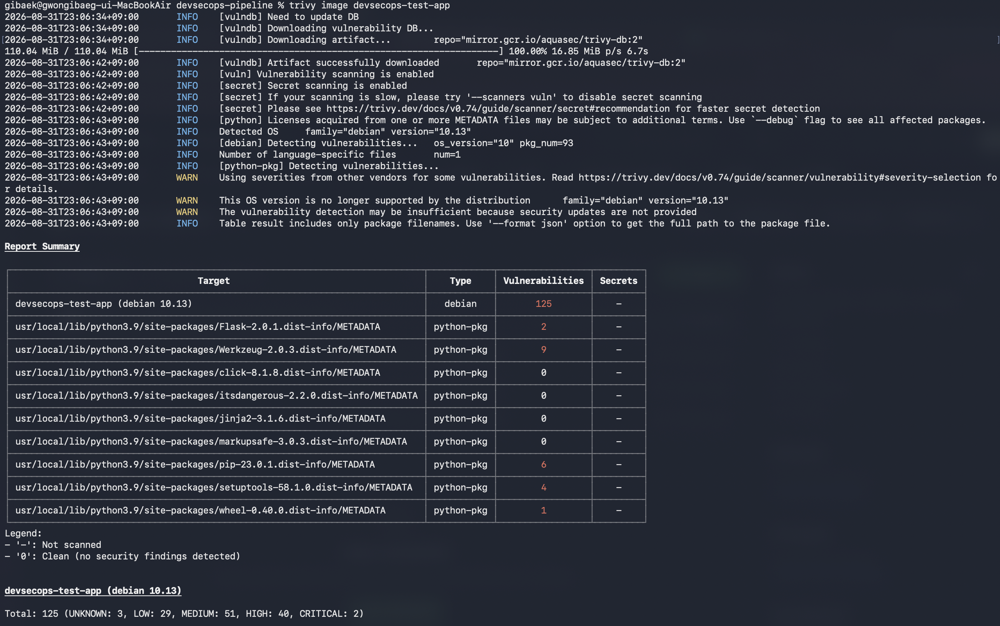
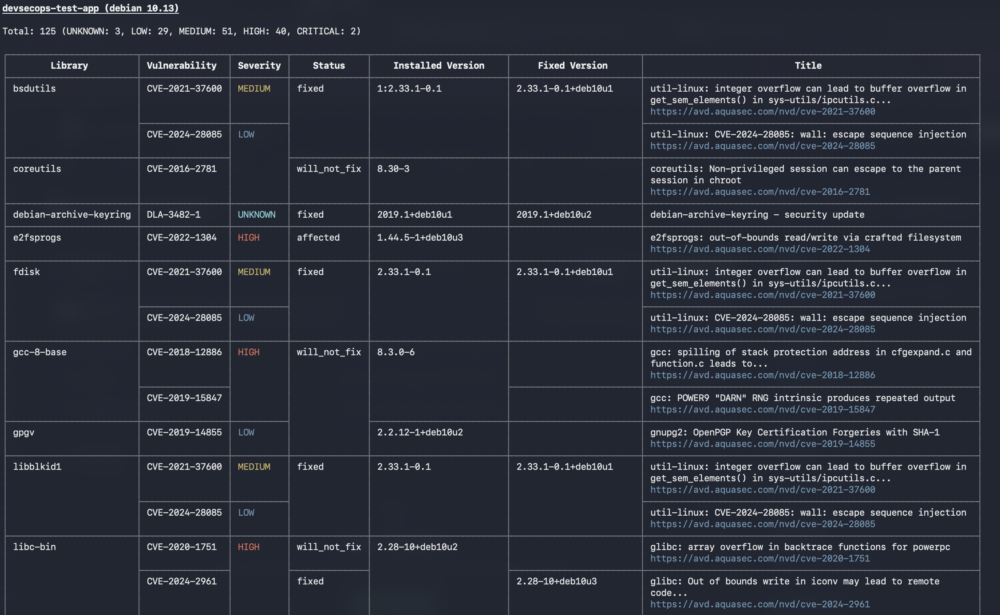
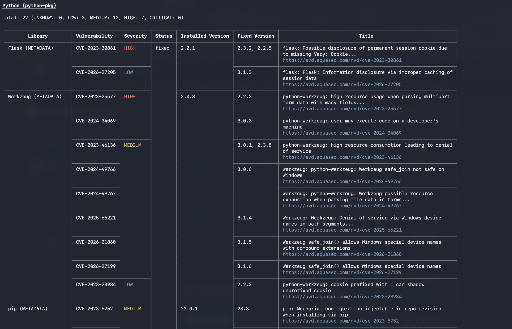
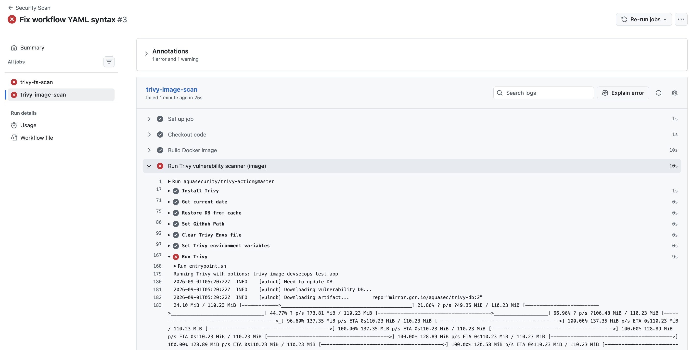

# DevSecOps Security Pipeline

## 프로젝트 목적
실제 보안 취약점을 탐지하고 **차단**하는 실무형 CI/CD 보안 파이프라인 구축.
단순 스캔 리포트 생성이 아니라, 심각도 기준 미달 시 배포 자체를 막는 정책 게이트를 목표로 합니다.

## 아키텍처
```text
Code Push → GitHub Actions
  ├─ trivy-fs-scan    : 코드/의존성 취약점 스캔 (SCA)
  └─ trivy-image-scan : Docker Build → 이미지 취약점 스캔
       ↓
  Critical/High 발견 시 파이프라인 실패 (배포 차단)
       ↓ (통과 시, 예정)
  NCP Container Registry → NCP 배포
```

## 기술 스택
- CI/CD: GitHub Actions
- SCA / Container Scan: Trivy
- Container: Docker
- Cloud (예정): Naver Cloud Platform (NCR)

## 진행 현황
- [x] 테스트용 취약점 Flask 앱 작성
- [x] Dockerfile 작성 및 로컬 빌드 확인
- [x] Trivy 로컬 스캔 (Critical 2 / High 40 발견)
- [x] GitHub Actions 자동화 (fs scan + image scan, 2-job 구조)
- [x] 정책 게이트 구현 — Critical/High 발견 시 파이프라인 자동 실패(차단) 확인 완료
- [ ] Gitleaks 시크릿 스캔 단계 추가
- [ ] Semgrep SAST 단계 추가
- [ ] NCP Container Registry 연동
- [ ] 결과를 GitHub Security 탭(SARIF)에 연동

## 스캔 결과 (Before — 로컬 수동 스캔)
의도적으로 오래된 베이스 이미지(`python:3.9-slim-buster`, EOL)를 사용해
Trivy가 실제로 다수의 취약점을 탐지하는지 검증했습니다.

### 1. 전체 요약 결과


### 2. OS 패키지 상세 취약점


### 3. Python 패키지 상세 취약점


## 파이프라인 자동화 결과 (After — GitHub Actions)
push 시 자동으로 fs scan + image scan이 실행되고, 취약점 발견 시 파이프라인이 스스로 실패(차단)합니다.

### 4. 두 스캔 job 실행 결과 (fs-scan / image-scan 모두 실패 = 정상 차단)


### 5. Image scan 상세 로그

