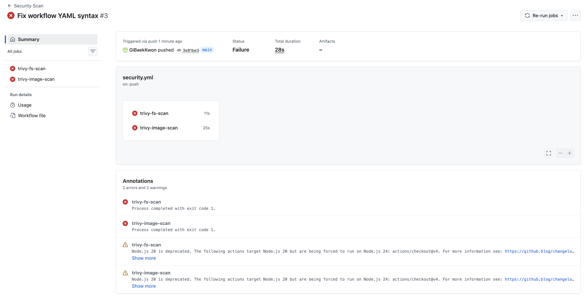
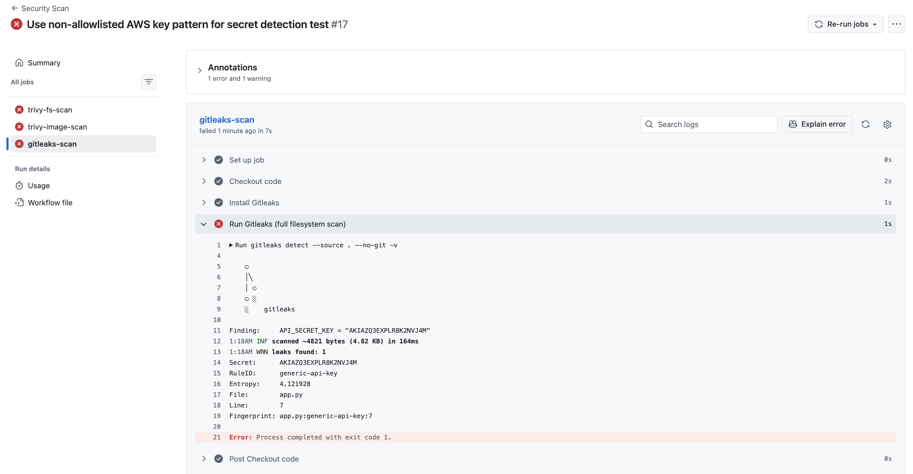
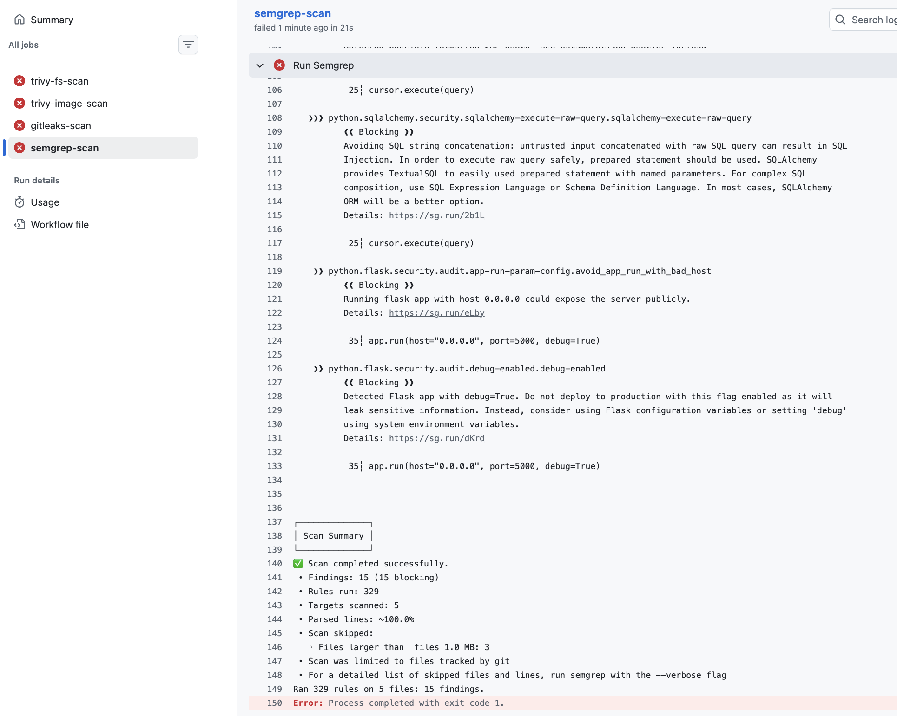
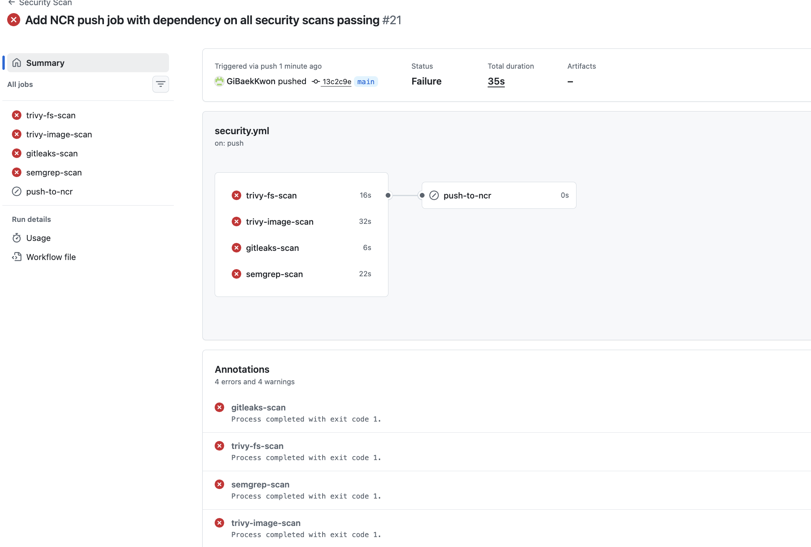
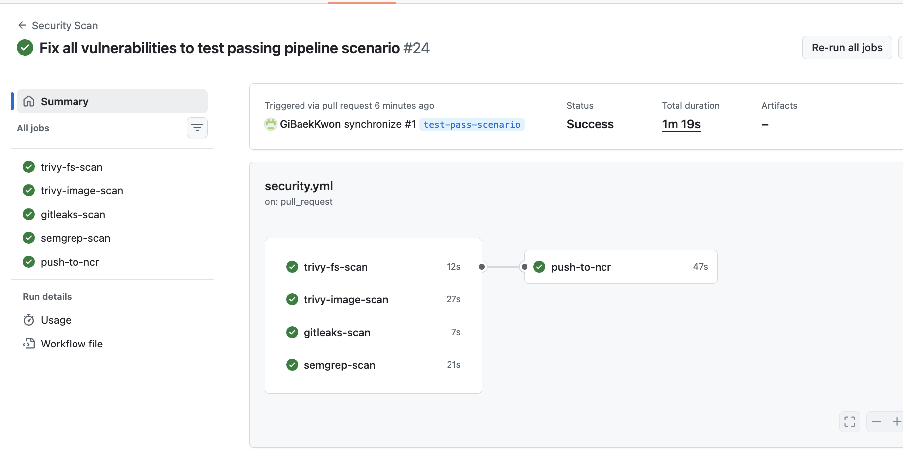
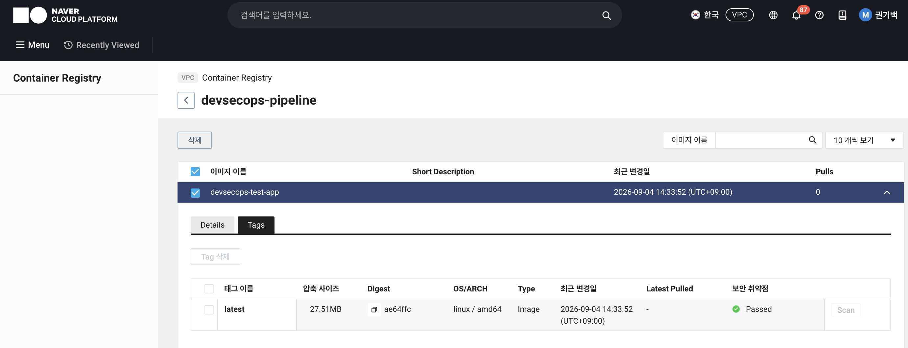

# DevSecOps Security Pipeline

## 프로젝트 목적
실제 보안 취약점을 탐지하고 **차단**하는 실무형 CI/CD 보안 파이프라인 구축.
단순 스캔 리포트 생성이 아니라, 심각도 기준 미달 시 배포 자체를 막는 정책 게이트를 목표로 합니다.

## 아키텍처
```text
Code Push → GitHub Actions
  ├─ trivy-fs-scan    : 코드/의존성 취약점 스캔 (SCA)
  ├─ trivy-image-scan : Docker Build → 이미지 취약점 스캔
  ├─ gitleaks-scan     : 하드코딩된 시크릿(API 키, 비밀번호 등) 탐지
  └─ semgrep-scan      : 코드 로직 취약점 탐지 (SAST)
       ↓
  4개 스캔 모두 통과해야만 다음 단계 진행 (needs 의존성)
       ↓
  push-to-ncr : NCP Container Registry로 이미지 push
```

취약점·시크릿이 하나라도 발견되면 해당 스캔 job이 실패하고,
`push-to-ncr`은 실행 자체가 **Skipped** 처리되어 배포가 원천 차단됩니다.

## 기술 스택
- CI/CD: GitHub Actions
- SCA / Container Scan: Trivy
- Secret Scan: Gitleaks
- SAST: Semgrep
- Container: Docker (Alpine 기반, non-root 사용자)
- Cloud: Naver Cloud Platform (NCP Container Registry)
- Supply Chain Security: GitHub Actions 커밋 SHA 고정

## 진행 현황
- [x] 테스트용 취약점 Flask 앱 작성
- [x] Dockerfile 작성 및 로컬 빌드 확인
- [x] Trivy 로컬 스캔 (Critical 2 / High 40 발견)
- [x] GitHub Actions 자동화 (4개 스캔 job 구성)
- [x] 정책 게이트 구현 — Critical/High 발견 시 파이프라인 자동 실패(차단) 확인 완료
- [x] Gitleaks 시크릿 스캔 단계 추가 — 하드코딩 시크릿 탐지 및 차단 확인 완료
- [x] Semgrep SAST 단계 추가 — SQL Injection 등 다수 취약점 탐지 및 차단 확인 완료
- [x] NCP Container Registry 연동 — 스캔 통과 시에만 이미지 push되는 정책 게이트 완성
- [x] GitHub Actions 커밋 SHA 고정 — 공급망 공격(supply chain attack) 방지
- [ ] 결과를 GitHub Security 탭(SARIF)에 연동

## 탐지된 취약점 요약

| 스캐너 | 대상 | 심각도/유형 | 발견 건수 | 파이프라인 처리 |
|---|---|---|---|---|
| Trivy (fs scan) | 코드/의존성 | Critical, High | 다수 발견 | 자동 차단 |
| Trivy (image scan) | Docker 이미지 (`python:3.9-slim-buster`) | Critical 2 / High 40 | 42건 | 자동 차단 |
| Gitleaks | 소스코드 내 하드코딩 시크릿 | generic-api-key (AWS 키 패턴) | 1건 (app.py:7) | 자동 차단 |
| Semgrep | 소스코드 로직 (`app.py`) | SQL Injection, 디버그 모드 노출, 호스트 바인딩 위험 등 | 15건 | 자동 차단 |

## 스캔 결과 (Before — 로컬 수동 스캔)
의도적으로 오래된 베이스 이미지(`python:3.9-slim-buster`, EOL)를 사용해
Trivy가 실제로 다수의 취약점을 탐지하는지 검증했습니다.

### 1. 전체 요약 결과


### 2. OS 패키지 상세 취약점


### 3. Python 패키지 상세 취약점


## 파이프라인 자동화 결과 (After — GitHub Actions)
push 시 자동으로 4개 스캔(fs scan + image scan + secret scan + SAST)이 실행되고,
취약점이나 시크릿 발견 시 파이프라인이 스스로 실패(차단)합니다.

### 4. 스캔 job 실행 결과


### 5. Image scan 상세 로그


### 6. Gitleaks 시크릿 탐지 로그
의도적으로 하드코딩해둔 `API_SECRET_KEY`(AWS 키 형식)가 `app.py` 7번째 줄에서
실제로 탐지되는지 검증했습니다.


### 7. Semgrep SAST 탐지 로그
SQL Injection, Flask 디버그 모드 노출, 호스트 바인딩 위험 등 코드 로직 수준의 취약점을 탐지했습니다.


## 배포 게이트 검증 (Deploy Gate — 차단/통과 시나리오)
스캔 결과에 따라 실제 배포(NCR push)가 조건부로 실행되는지 두 가지 시나리오로 검증했습니다.

### 8. 차단 시나리오 — 취약점 발견 시 배포 자동 차단
4개 스캔 중 하나라도 실패하면 `push-to-ncr`은 실행되지 않고 **Skipped** 처리됩니다.


### 9. 통과 시나리오 — 취약점 해결 후 배포 자동 실행
SQL Injection 수정, 하드코딩 시크릿 제거, Alpine 기반 이미지 전환(Trivy 취약점 0건),
non-root 사용자 적용 후 4개 스캔이 모두 통과하자 `push-to-ncr`이 정상 실행되었습니다.


### 10. NCP Container Registry 배포 확인
실제로 이미지가 NCR에 push되어 보안 취약점 검사도 통과(Passed)한 것을 확인했습니다.

